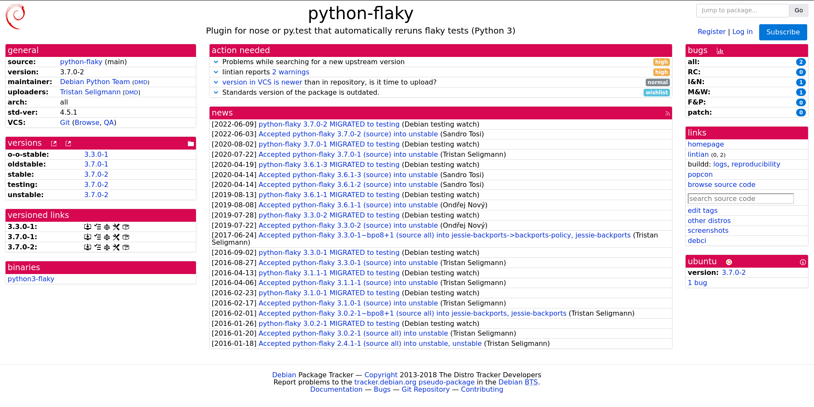
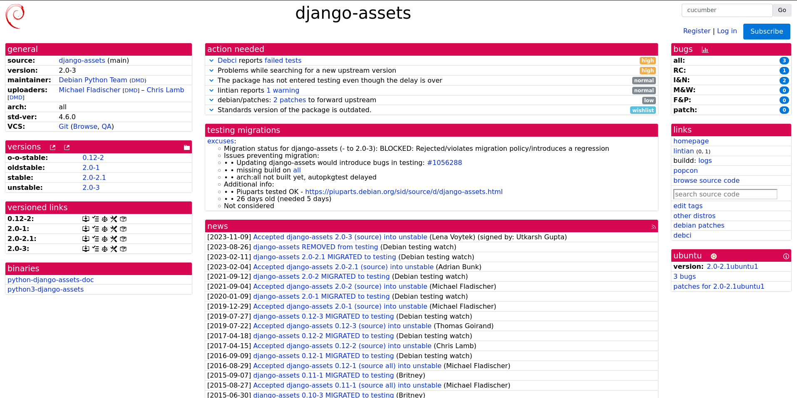
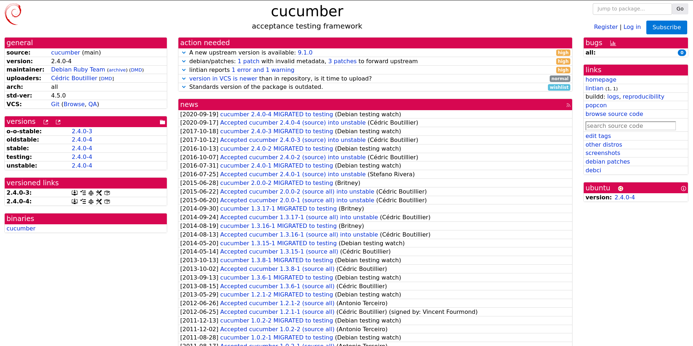
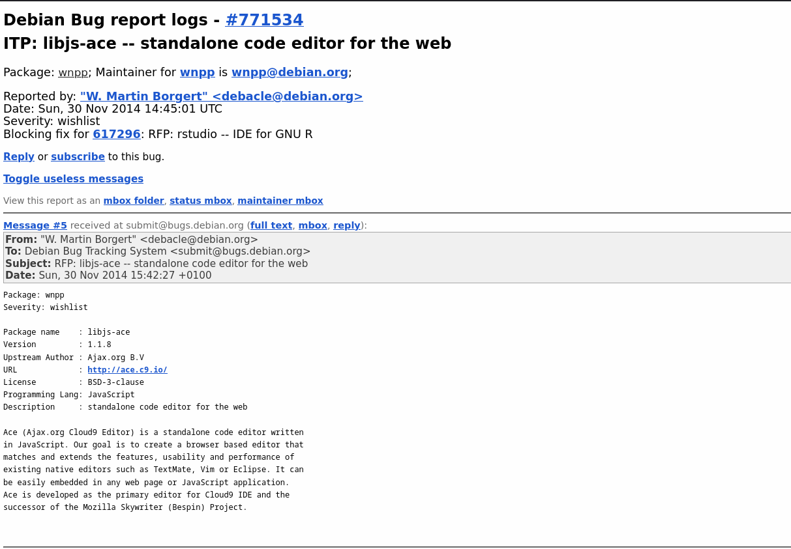

## Informações

- [Usuário no Salsa: @dartmol203](https://salsa.debian.org/dartmol203)

## Pacotes trabalhados

### python-flaky

Correção do Watch, Eliminação da dependência no pacote python-nose, criação de patch.

- [Tracker](https://tracker.debian.org/pkg/python-flaky)
- [Issue](https://salsa.debian.org/debian-brasilia-team/docs/-/issues/65)
- [Merge Request](https://salsa.debian.org/python-team/packages/python-flaky/-/merge_requests/2)
- Colaborador(es): [Mariana Rio](https://salsa.debian.org/mprio_zip)
- Status: **review**

### django-assets

Correção do Watch, Debci reports failed tests, The VCS repository is not up to date, lintian, atualizar standard version, remover python-nose

- [Tracker](https://tracker.debian.org/pkg/django-assets)
- [Issue](https://salsa.debian.org/debian-brasilia-team/docs/-/issues/109)
- Colaborador(es): [Mariana Rio](https://salsa.debian.org/mprio_zip)
- Status: **doing**

### cucumber

Atualização da versão upstream e standards version.

- [Tracker](https://tracker.debian.org/pkg/cucumber)
- [Issue](https://salsa.debian.org/debian-brasilia-team/docs/-/issues/121)
- Colaborador(es): [Mariana Rio](https://salsa.debian.org/mprio_zip)
- Status: **Review**

### libjs-ace -- standalone code editor for the web

- [ISSUE](https://salsa.debian.org/debian-brasilia-team/docs/-/issues/141)
- status: **doing**